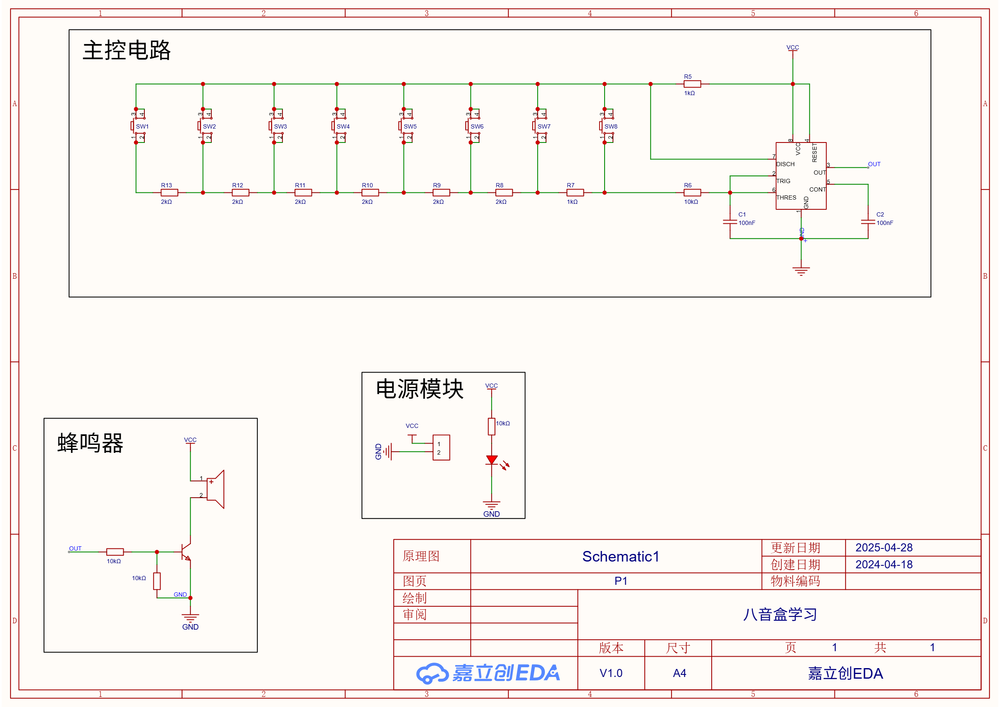

# Week5：PCB电路板设计

## 教学目标

本次培训以“能独立完成一个简单电子项目”为导向，目标分为三个层级：

### 1. 基础认知目标

- 理解PCB设计的基本流程：**原理图设计 → 封装匹配 → PCB布局布线 → 导出生产文件**
- 认识常见电子元件：电阻、电容、蜂鸣器、按键、单片机/逻辑芯片等
- 理解“原理图 ≠ PCB”的概念，以及两者之间的映射关系（网络表）

### 2. 工具使用目标

- 熟练使用**立创EDA**完成以下操作：
  - 创建工程、绘制原理图
  - 查找并调用标准库元件
  - 进行封装绑定（Footprint）
  - 生成并进入PCB设计界面
  - 完成基础布局与手动布线
- 掌握基础设计规则（如线宽、间距、电源走线原则）

### 3. 项目实践目标

- 独立完成一个“八音琴电路”的：
  - 原理图设计
  - PCB板设计
- 理解音调产生原理
- 能解释自己设计的电路结构

## 教学内容

### 1、八音琴电路讲解（原理理解 + 思维建立）

通过一个完整的小项目引入——基于 **NE555** 的八音琴电路。

- 电路组成：
  - 8个按键（输入）
  - 电阻网络（控制频率）
  - NE555（产生方波信号）
  - 无源蜂鸣器（发声）
- 工作原理：
  - 按下不同按键 → 选择不同电阻
  - 电阻变化 → 改变振荡频率
  - 频率不同 → 输出不同音调
- 教学重点：
  - 理解“**频率决定音高**”
  - 理解“**用电阻控制频率**”这一核心思想
  - 能说清每个模块在电路中的作用（输入 / 控制 / 输出）

👉 本环节目标不是背电路，而是建立“电路如何工作的整体认知”。

### 2、原理图设计（从“会看”到“会画”）

基于讲解后的电路结构，使用 **立创EDA** 完成原理图绘制。

- 基础操作训练：
  - 创建工程与原理图文件
  - 搜索并放置元件（NE555、按键、电阻、电容、蜂鸣器）
  - 正确连接电路（NET连接）
  - 添加电源符号（VCC / GND）
- 重点能力培养：
  - 能根据讲解**复现电路结构**
  - 学会使用网络标号（避免连线混乱）
  - 理解原理图的阅读逻辑（信号流向）
- 检查与规范：
  - 使用 ERC（电气规则检查）
  - 避免悬空引脚、错误连接

👉 本环节目标：从“看懂电路”过渡到“自己能画出来”。

### 3、电路板设计

将原理图转换为实际PCB，完成从“电路逻辑”到“物理实现”的过程。

- PCB设计流程：
  - 导入PCB界面（从原理图生成）
  - 元器件布局（Placement）
  - 手动布线（Routing）
  - 根据自身喜好添加个性化丝印或者设计独特的电路板外型等
- 布局指导：
  - 按键按“琴键逻辑”排布（便于操作）
  - 蜂鸣器靠边或留孔（方便发声）
  - 电源部分尽量集中
- 布线基本规范：
  - 电源线适当加粗
  - 避免直角走线（使用45°）
  - 尽量减少交叉和过孔
  - 合理铺铜（GND）
- 检查：
  - 通过 DRC（设计规则检查）
  - 确保无未连接网络（无飞线）

👉 本环节目标：让学生理解“PCB不是画图，而是工程设计”。

### 4、利用嘉立创免费打板下单PCB

下载“嘉立创下单助手”领取免费打板券，100mm*100mm以内可以免费下单打板。

## 验收内容

1、检查原理图

2、检查电路板设计图

3、检查实物电路板

## 附：八音盒原理图

